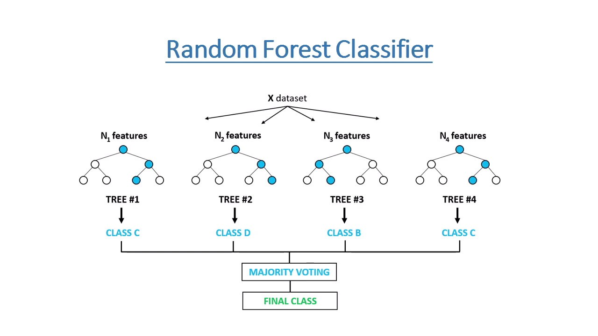

# Machine Learning 
<h1 align='center'>Matplotlib</h1>

- how to import it and plot a graph for Scattering and Plotting : 


    ```
    import matplotlib.pyplot as plt

    plt.scatter(x,y,c='r',marker='*') 

    plt.plot(x,y,c='r')
    ```
- for more [click me👆](https://matplotlib.org/stable/api/_as_gen/matplotlib.pyplot.scatter.html)

&nbsp;
<h1 align='center'>train_test_split</h1>

- how to import it and use it : 

    ```
    from sklearn.model_selection import train_test_split

    X_train,X_test,Y_train,Y_test = train_test_split(x,y,test_size=0.2,random_state=42)
    ```
- for more [click me👆](https://scikit-learn.org/stable/modules/generated/sklearn.model_selection.train_test_split.html)

&nbsp;
<h1 align='center'>Saving The Model</h1>

- we can use __Pickle__ and __Joblib__ but joblib is easy to implement.

    ```
    from joblib import dump, load 
    ```
- Saving and Loading: 
    ```
    dump(model,'dumping_name')

    model = load('dumping_name')
    ```
&nbsp;
<h1 align='center'>Dummy Variable's</h1>

- How do we get the dummy variables for a specific feed feature.

- There are two ways __One hot encoding__ & __pandas.get_dummies()__.

- How to get a dummy for **Car** Model__.
    <p align="center">
        
    </p>

    ```
    dummy = pd.get_dummies(df['Car Model'],dtype=int)
    ```
    <p align="center">
        
    </p>

&nbsp;
<h1 align='center'>Linear Regression</h1>

- how to import Algorithm

    ```
    from sklearn.linear_model import LinearRegression
    ```
- how use it?
    ```
    model = LinearRegression()

    model.fit(X,Y)
    ```
- Check Accuracy :
    ```
    model.score(x_test,y_test)
    ```
- Predict the Y-axis :
    ```
    model.predict(value of x)
    ```
- Example :
    <p align="center">
        
    </p>
- for more [click me👆](https://scikit-learn.org/stable/modules/generated/sklearn.linear_model.LinearRegression.html)

&nbsp;
<h1 align='center'>Mutivarite Regression</h1>

- Same as Linear  LinearRegression() but here the feed feature(X-axis) is multiple.

- how use it?
    ```
    model = Linearmodelression()

    model.fit(df[[x1,x2,x3]],y)
    ```
- get the Slope(m) and Intercept(c) :
    ```
    m = model.coef_

    c = model.intercept_
    ```
- for more [click me👆](https://scikit-learn.org/stable/modules/generated/sklearn.linear_model.LinearRegression.html)

&nbsp;
<h1 align='center'>Gradient Decendent</h1>

- Gradient descent is an optimization algorithm that is commonly used in machine learning and neural networks. It is used to find the values of a function's parameters that minimize a cost function.

- __Best fit find by .fit() function.__
    ```
    model = linear_model.LinearRegression()

    model.fit(x,y)

    plt.scatter(x, y, color='red')  

    plt.plot(x,model.predict(x))
    ```
    <p align="center">
        
    </p>
    
    
- __Best fit by Gradient Decendent Algoritham.__

    ```
    def gradient_descent(x, y, iter=1000,lr=0.01):

        m_curr = b_curr = 0

        n = len(x)

        for i in range(iter):

            y_predicted = m_curr * x + b_curr

            cost = (1/n) * sum([val**2 for val in (y - y_predicted)])

            md = -(2/n) * sum(x * (y - y_predicted)) # derivative of cost(mse) wrt m 

            bd = -(2/n) * sum(y - y_predicted)

            m_curr = m_curr - lr * md

            b_curr = b_curr - lr * bd

            if i%100==0:

                plt.plot(x, y_predicted)

                print("m={} , b={} , cost={} , iteration={}".format(m_curr, b_curr, cost, i))

        return m_curr,b_curr


    m,b = gradient_descent(x_normalized,y_normalized,iter=10000,lr=0.001) # lr = learning Rate
    ```
    <p align="center">
        
    </p>
    <p align="center">
        
    </p>
- for more [click me👆](https://www.javatpoint.com/gradient-descent-in-machine-learning)

&nbsp;
<h1 align='center'>Logistic Regression</h1>

- How to import __Logistic Regression__ Algorithm.

    ```
    from sklearn.linear_model import LogisticRegression
    ```

- How to use it ?
    ```
    model = LogisticRegression()

    model.fit(X_train,Y_train)

    model.predict(X_test)

    model.score(X_test,Y_test)
    ```

    
    
- How to check Probablity of certain data ?
    ```
    model.predict_proba(X_test)
    ```
-   X_test dataset:<br>
    &nbsp; &nbsp;    age <br>
    7	&nbsp;60  <br>
    5	&nbsp;56  <br>
    18	19  <br>

-   __Output : <br>
    array( [ [0.06470723, 0.93529277], <br>
       [0.10327405, 0.89672595], <br>
       [0.92775095, 0.07224905] ] ) <br>
        # 60 age have 2 probablity 0.064 and 0.93 means 0.93 likely to buy insurance.__

- __Solvers__ in Logistic Regression.
    ```
    solver = {‘lbfgs’, ‘liblinear’, ‘newton-cg’, ‘newton-cholesky’, ‘sag’, ‘saga’}

    default=’lbfgs’
    ```
- for more [click me👆](https://scikit-learn.org/stable/modules/generated/sklearn.linear_model.LogisticRegression.html)

&nbsp;
<h1 align='center'>Multiclass Logistic Regression</h1>

- it is as simillar as above, the difference is of  X-axis as it have multiple features insted of single.

    ```
    x = df[[x1,x2,x3,...,xn]]

    y = df['target']
    ```
- for more [click me👆](https://scikit-learn.org/stable/modules/generated/sklearn.linear_model.LogisticRegression.html)

&nbsp;
<h1 align='center'>Support Vector Machine (SVM)</h1>

- Support Vector Machine (SVM) is a type of algorithm that draws the best possible line between different groups of data points to classify them accurately.

- Support Vector Machine (SVM) is a supervised machine learning algorithm used for classification and regression tasks. It works by finding the hyperplane that best separates different classes in the feature space. In classification tasks, SVM aims to find the optimal hyperplane that maximizes the margin between classes, while in regression tasks, it aims to minimize the error between the predicted and actual values.

    
- how to import SVM ;
    ```
    from sklearn.svm import SVC
    ```

- how to use it ; 
    ```
    model = SVC()

    model.fit(x,y)
    ```

- Kernals in SVM : Kernals are mainly use to distribute the data points in multiple dimensions.
    ```
    kernel = {‘linear’, ‘poly’, ‘rbf’, ‘sigmoid’, ‘precomputed’} or callable  
    
    default=’rbf’
    ```
- Regularization(C) in SVM ;
    ```
    model = SVC(C=5.0)

    model.fit(x,y)

    C = float number 

    default=1.0
    ```
    - __High Regularization(C) lead to overfitting.__
    - __Low Regularization(C) lead to Underfitting.__

        <p align="center">
            
        </p>
- for more [click me👆](https://scikit-learn.org/stable/modules/generated/sklearn.svm.SVC.html)

&nbsp;
<h1 align='center'>Decision Tree Regressor</h1>

- A decision tree regressor is a machine learning algorithm that uses a tree-like model to predict target values for continuous variables. The algorithm works by splitting nodes into sub-nodes until it reaches a leaf node that contains the prediction.

- __It is the best Algorithm among Regression.__
- How to import it ;

    ```
    from sklearn.tree import DecisionTreeRegressor
    ```

- How to use it ;
    ```
    model = DecisionTreeRegressor( )

    model.fit(x,y)
    ```

- criterion in DecisionTreeRegressor( )
    ```
    criterion = {“squared_error”, “friedman_mse”, “absolute_error”, “poisson”} 
    
    default = “squared_error”
    ```
    

- for more [click me👆](https://scikit-learn.org/stable/modules/generated/sklearn.tree.DecisionTreeRegressor.html)

&nbsp;
<h1 align='center'>Decision Tree Classifier</h1>

- A decision tree is a type of supervised machine learning algorithm that uses a flowchart to make predictions and decisions based on a data set.
- how to import it ;

    ```
    from sklearn.tree import DecisionTreeClassifier
    ```
- how to use it ;

    ```
    model = DecisionTreeClassifier()
    
    model.fit(x,y)
    ```

- criterion in DecisionTreeClassifier() gives the the function to measure the quality of a split. Supported criteria are __“gini”__ for the __Gini impurity__ and __“log_loss”__ and __“entropy”__ both for the __Shannon information gain__ ;
    ```
    criterion = {“gini”, “entropy”, “log_loss”}
    
    default=“gini”
    ```
    - __“gini”__ : Let's say you have a jar of candies, and most of them are red, but there are a few blue and green ones mixed in. The Gini impurity would be high because it's pretty mixed up.

        Now, if you divide these candies into separate jars based on color, and each jar has mostly one color, the Gini impurity would be low because each jar is more uniform.

        In a decision tree, we want to split our data (like candies) into groups that are as pure as possible, meaning they have mostly one type of outcome (like one color of candy). Low Gini impurity means the groups are more pure and easier to make predictions from.
        
        __It is mainly used for choose the root node for DecisionTreeClassifier to make predictions.__ 

        [for more explanation👆](https://medium.com/@ompramod9921/decision-trees-91530198a5a5)

        

    - __“entropy”__ : Think of it like a messy room. If a room is very messy, it has high entropy because things are all over the place and disorderly. If a room is very tidy and everything is neatly arranged, it has low entropy because there's less disorder.

        Similarly, in a dataset, if it's all mixed up with different outcomes or labels, it has high entropy. But if it's well organized with mostly one outcome or label, it has low entropy.

        In decision trees, entropy helps us decide where to split the data by aiming to minimize it with each split. Lower entropy means the subsets are more organized and easier to make predictions from.
        
        __entropy is a measure of disorder or impurity in a node.__ 

        [for more explanation👆](https://medium.com/codex/decision-tree-for-classification-entropy-and-information-gain-cd9f99a26e0d)

- how to see decision tree ;
    ```
    from sklearn.tree import plot_tree
    
    fig = plt.figure(figsize=(25,20)) 

    _ = plot_tree(model,feature_names,class_names,filled=True)
    ```
    

- for more [click me👆](https://scikit-learn.org/stable/modules/generated/sklearn.tree.DecisionTreeClassifier.html)


&nbsp;
<h1 align='center'>Random Forest Classifier</h1>

- A random forest classifier is a type of ensemble learning method that creates multiple decision trees to classify an input vector.

    

- How to import it ;
    ```
    from sklearn.ensemble import RandomForestClassifier
    ```
- How to use it ;
    ```
    model = RandomForestClassifier()

    model.fit(x_train,y_train)
    ```
- __n_estimators__ is use to select variable amount of trees in forest (The number of trees in the forest).
    ```
    model = RandomForestClassifier(n_estimators=10)

    n_estimators default : 100
    ```
- __criterion__ also use for checking the impurities of the decision tree inside of Random Forest, and the lowest of all impurities will considered as root node for Decision tree. 
    ```
    criterion = {“gini”, “entropy”, “log_loss”} 
    
    default=“gini”
- __More accurate predictions require more trees, resulting in slower models.__

- for more [click me👆](https://scikit-learn.org/stable/modules/generated/sklearn.ensemble.RandomForestClassifier.html)


&nbsp;
<h1 align='center'>KNN</h1>